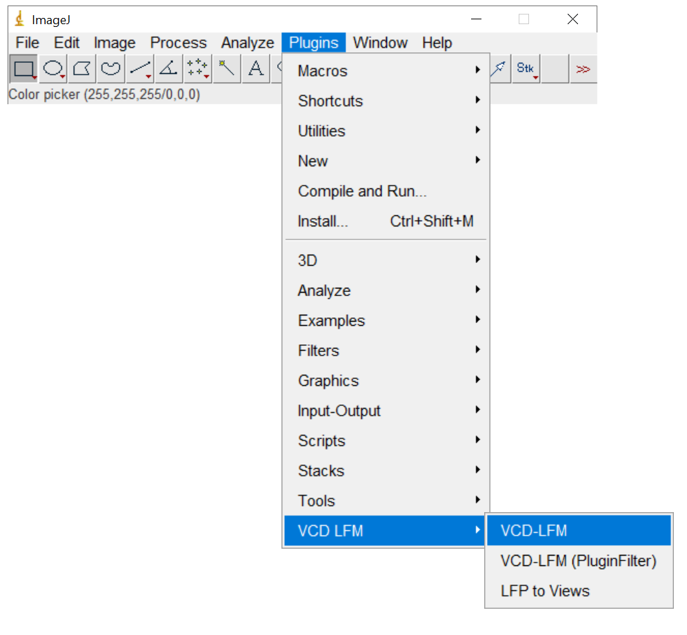
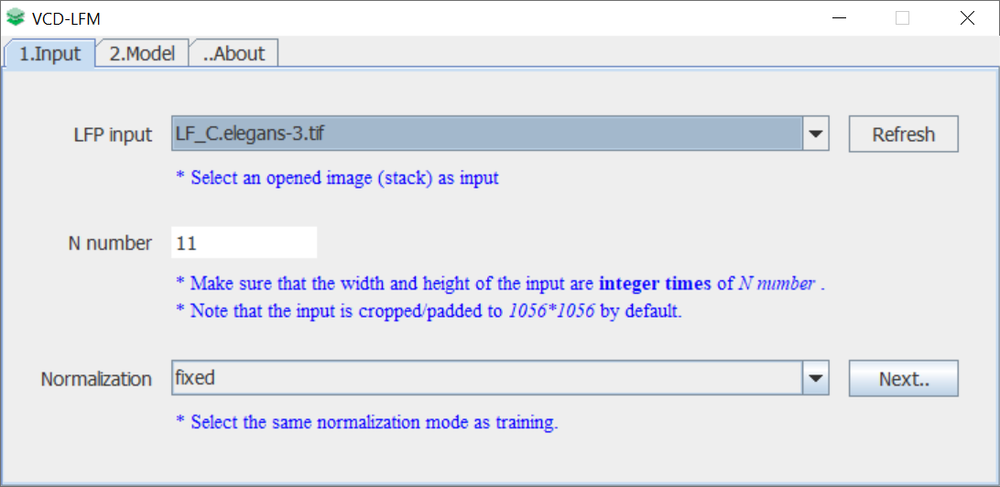
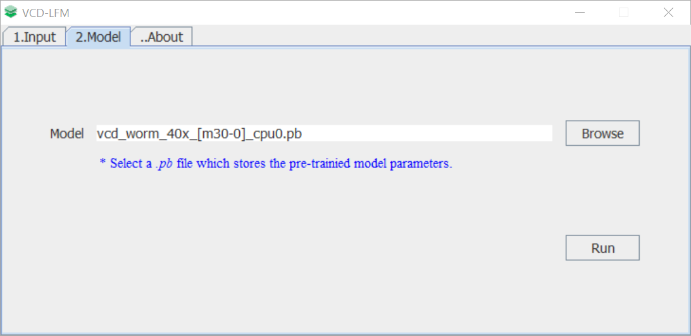
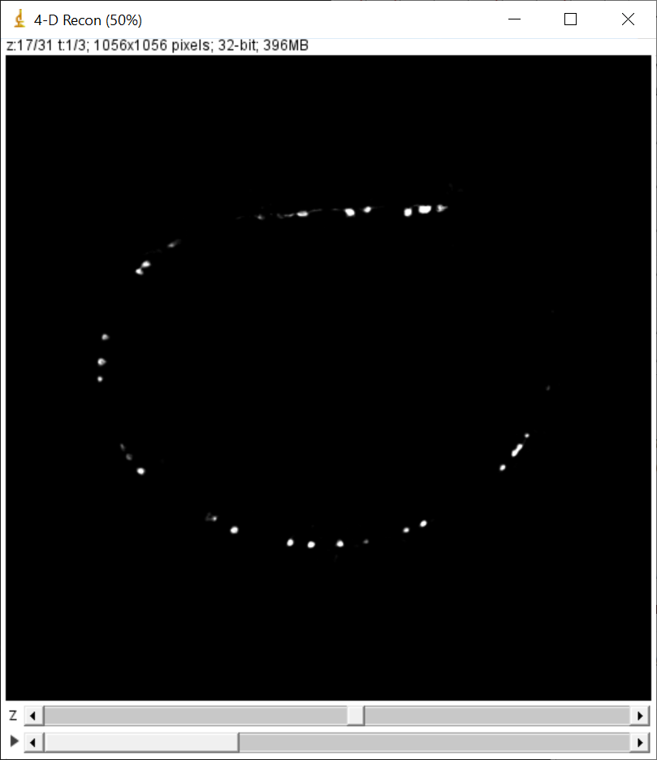
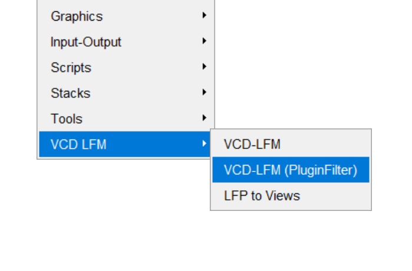
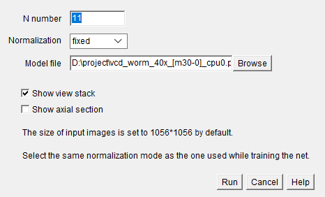
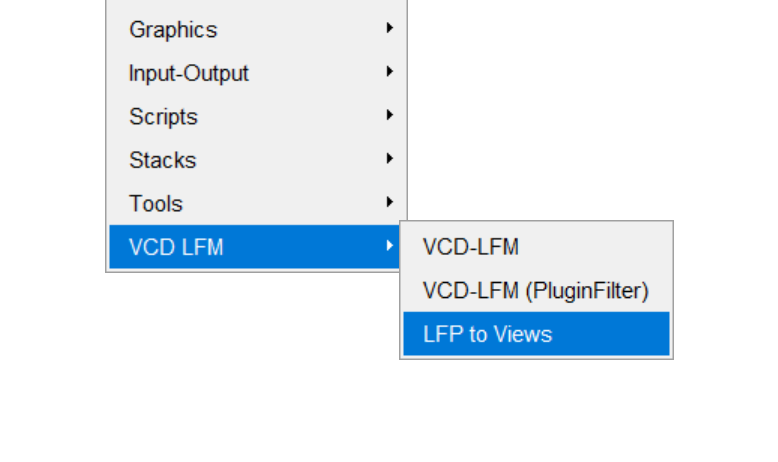

# ImageJ Plugins for VCD-Net.
An ImageJ plugin that implements the inference stage of VCD-Net. This plugin takes a single or a series (i.e., an ImageJ image stack) of light-field images as input, loads a tensorflow protobuffer file (.pb) that stores the pre-trained model parameters, and run the VCD reconstruction to generate a 3-D (for single image input) or 4-D (for image series input) stack. Please cite our [Nature Methods article](https://www.nature.com/articles/s41592-021-01058-x) if you used this software in your research.

## Install
* Download the `/ImageJ` folder and merge `/jars` and `/plugins` folders with ones in your ImageJ installing directory. 
* Restart the ImageJ software, an item named "VCD LFM" under "Plugins" menu will be found.

_Note_: Please delete any other .jar files named 'ij-1.xxx.jar' under `your-imagej-installing-path/jars`, and keep the one named `ij-1.53g.jar` provided in this repository.

## Usage

### Plugin for multi-frame inputs.
1. Open "Plugins->VCD LFM->VCD LFM".





2. Open your light-field images as an ImageJ stack and select it by clicking the popup list. If your image were not found, press the "Refresh" button.
3. Choose the proper N number and normalization method.
4. Click "Next" button.



5. Select your model file on the disk by clicking "Browse" button. An example `.pb` file is provided together with the plugin. To use your own model, run:
    ```
    python eval.py --save_pb --cpu
    ```
after training your own model with our python VCD-Net program.


6. Click "Run" button to start the inference. While done, a 4-D HyperStack will show.



### PluginFilter for single-frame inputs.
This mode extends ImageJ `PlugInFilter` API. Before using it, an image must be opened in the ImageJ window.
1. Open "Plugins->VCD LFM->VCD LFM (PluginFilter)".



2. Choose the proper N number, normalization and pb file as above mentioned.


3. Start the inference bu clicking "Run" button.

### Angular views extractor.
Our VCD-LFM plugin also provides a tool for visualize angular views from a single light-field image. 

By opening "Plugins->VCD LFM->LFP to Views", the active window of light-filed image will be splitted into angular views as an image stack:



